# WuPlay

**A Stremio alternative built for Android TV.**

WuPlay (pronounced woo-play) is a privacy-focused streaming app with multi-device sync that works with Stremio add-ons. No account registration required — just set up a profile and start watching.

## Features

- **Privacy focused** — no account registration, no IP tracking, no sign-up walls
- **Built-in metadata** — use the built-in metadata provider, or use a third-party add-on
- **Stremio add-on compatible** — use your favorite Stremio add-ons (see [addon sdk](https://github.com/me-here-now/wuplay-addon-sdk) for details)
- **Add-ons auto update** — add-ons stay current without manual refresh or reinstall
- **Full control over catalogs** — show, hide, and reorder catalogs to customize your home and discover screens
- **Web configurator** — manage add-ons, catalogs, and data from any browser
- **Profiles** — multiple profiles with per-profile settings, watchlists, watch history, and add-ons
- **Watchlists** — organize what you want to watch, including saving search results directly to a watchlist
- **Watch history & progress tracking** — pick up where you left off across movies and series
- **Multi-device sync** — keep your library, watchlists, watch history, and progress in sync across Android TV devices
- **Cast & crew** — view cast and crew for any title, with detailed person pages including full filmography
- **Similar titles** — find related movies and shows from any detail page
- **Preferred language** — set your preferred audio and subtitle languages per profile
- **Autoplay** — automatically play the first available stream or the next episode in a series
- **Trailers** — watch trailers

## Screenshots

<table>
  <tr>
    <td align="center">
      <a href="screenshots/profiles1.png">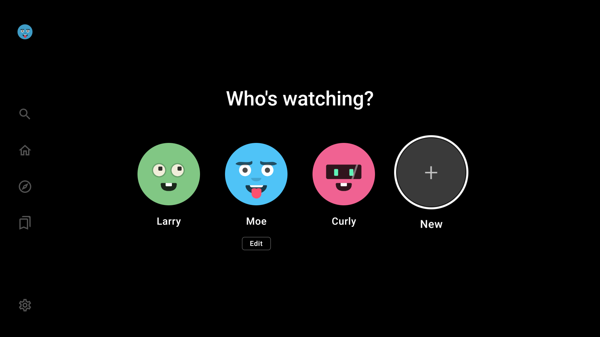</a> 
      Who's Watching
    </td>
    <td align="center">
      <a href="screenshots/home.png">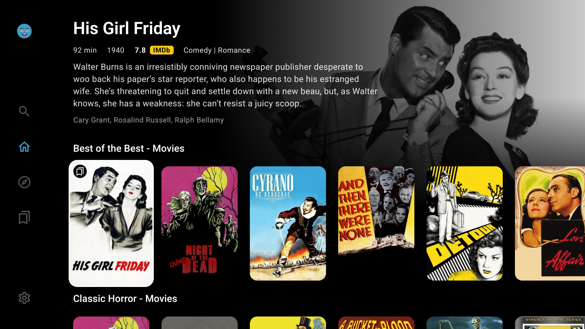</a> 
      Home
    </td>
    <td align="center">
      <a href="screenshots/discover.png">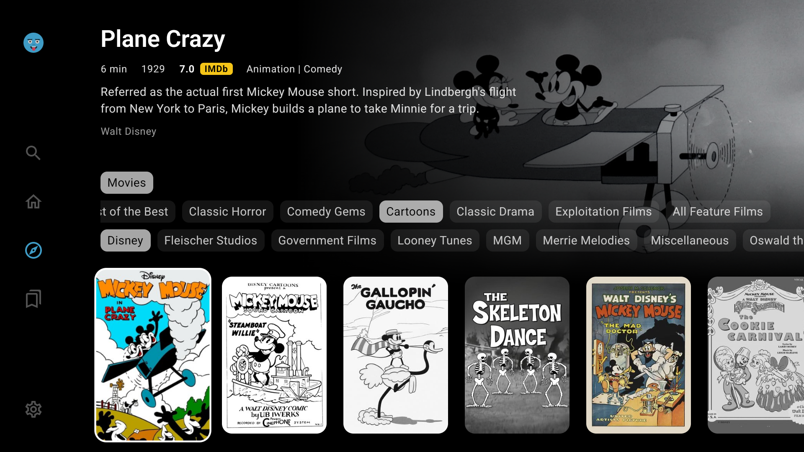</a> 
      Discover
    </td>
  </tr>
  <tr>
    <td align="center">
      <a href="screenshots/lists1.png">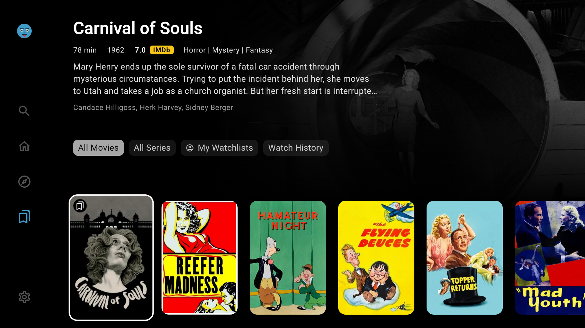</a> 
      My Lists
    </td>
    <td align="center">
      <a href="screenshots/search.png">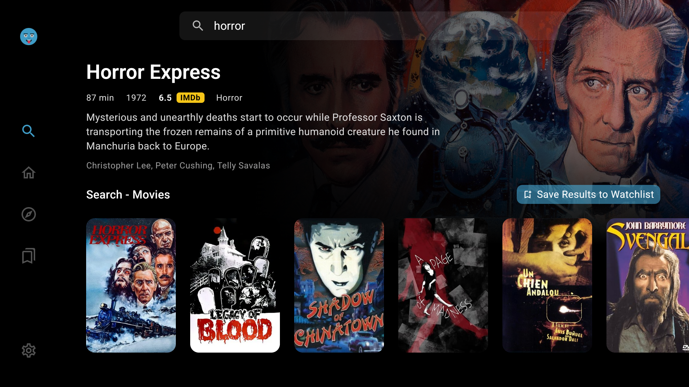</a> 
      Search
    </td>
    <td align="center">
       
      Details
    </td>
  </tr>
  <tr>
    <td align="center">
      <a href="screenshots/similar.png">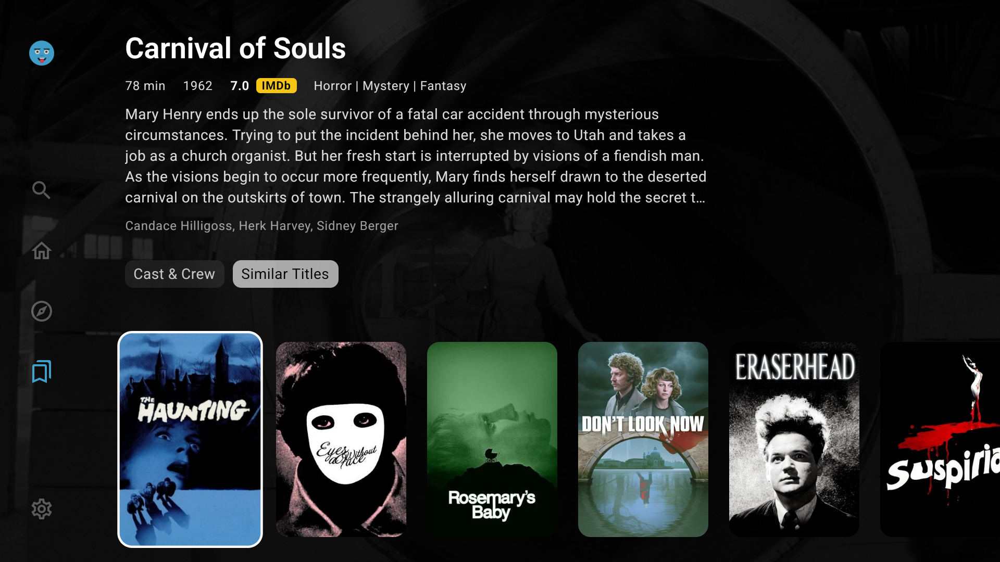</a> 
      Similar Titles
    </td>
    <td align="center">
       
      Cast & Crew
    </td>
    <td align="center">
      <a href="screenshots/cast2.png">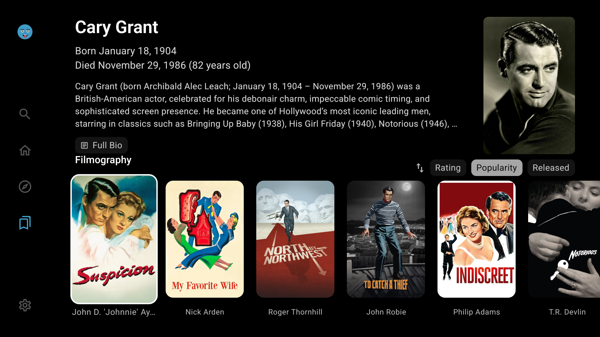</a> 
      Person Details
    </td>
  </tr>
  <tr>
    <td align="center">
      <a href="screenshots/lists2.png">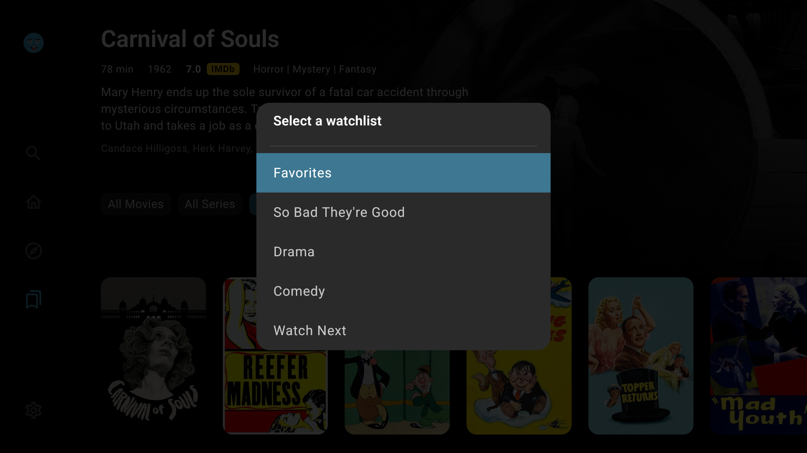</a> 
      Watchlists
    </td>
    <td align="center">
      <a href="screenshots/profiles2.png">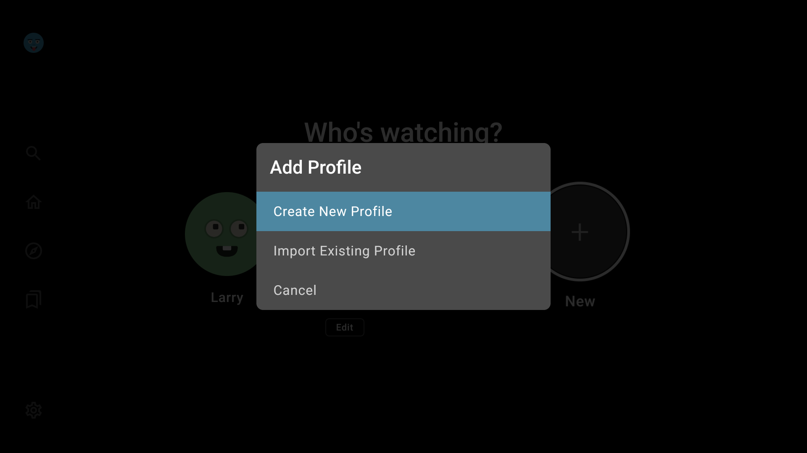</a> 
      Add Profile
    </td>
    <td align="center">
      <a href="screenshots/profiles3.png">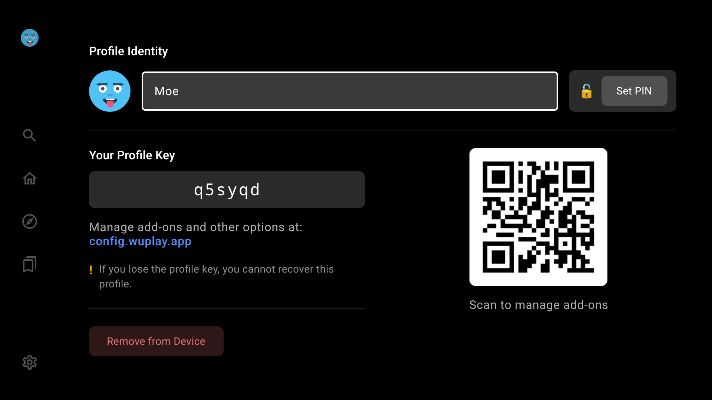</a> 
      Edit Profile
    </td>
  </tr>
  <tr>
    <td align="center">
      <a href="screenshots/profiles4.png">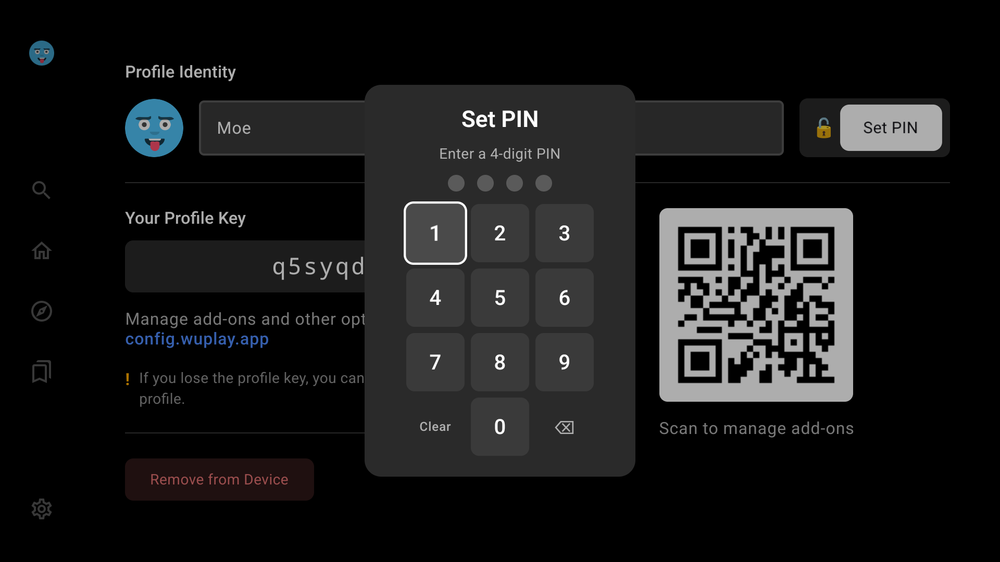</a> 
      Profile Set PIN
    </td>
    <td align="center">
      <a href="screenshots/settings.png">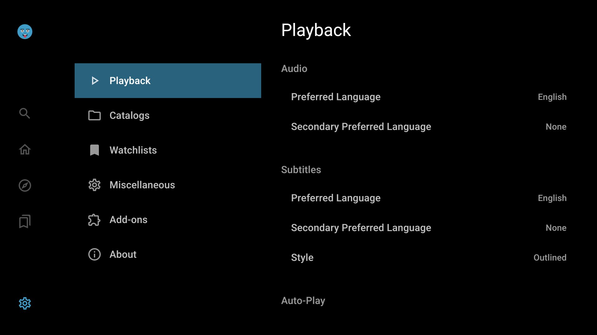</a> 
      Settings
    </td>
    <td></td>
  </tr>
</table>

### Web Configurator

<table>
  <tr>
    <td align="center">
      <a href="screenshots/configurator1.jpg">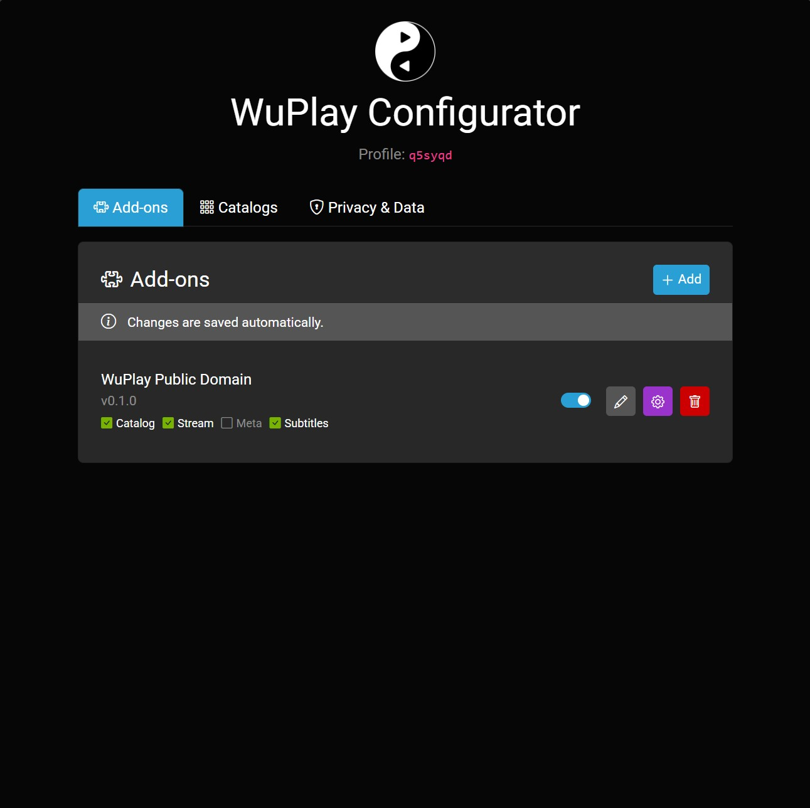</a> 
      Addons
    </td>
    <td align="center">
      <a href="screenshots/configurator2.jpg">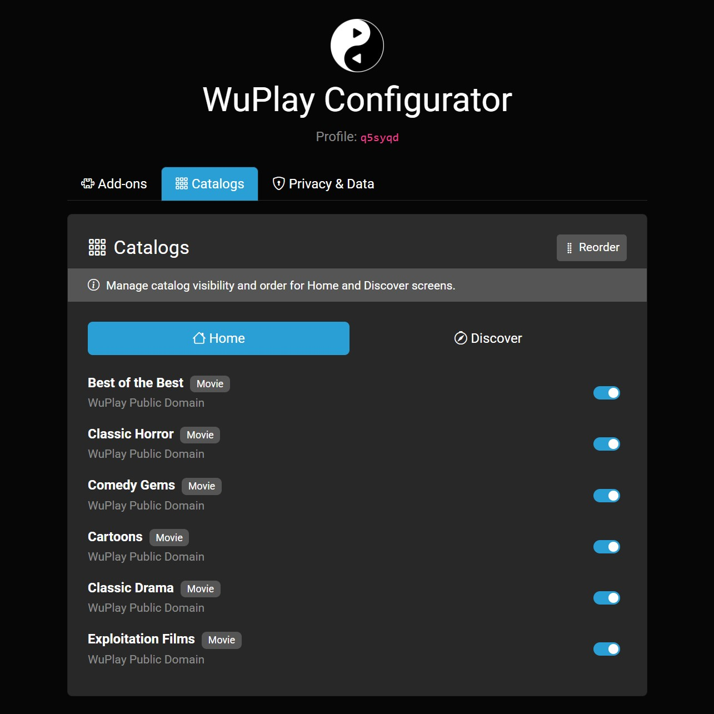</a> 
      Catalogs
    </td>
    <td align="center">
      <a href="screenshots/configurator3.jpg">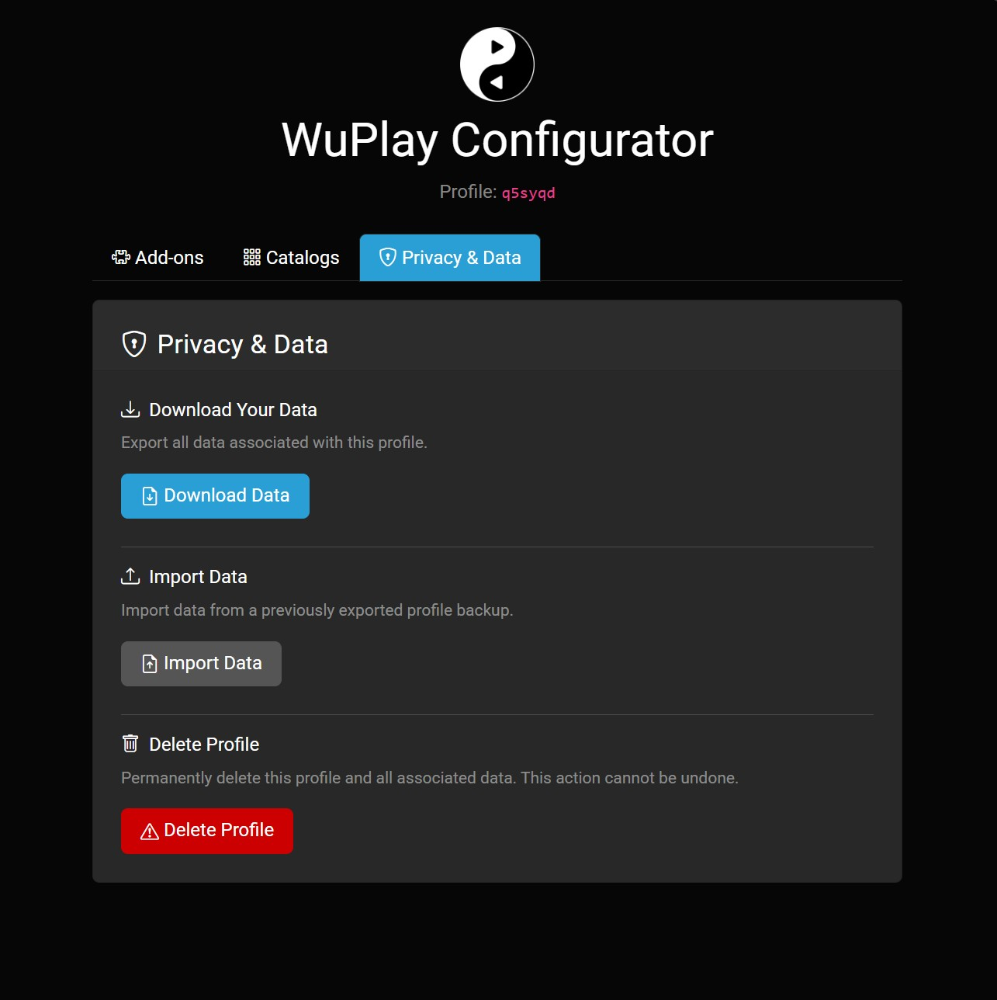</a> 
      Privacy & Data
    </td>
  </tr>
</table>

## Getting Started

## Install

**[Download latest APK](https://github.com/me-here-now/wuplay-releases/releases/latest/download/wuplay-androidtv.apk)**

Or install the [Downloader](https://play.google.com/store/apps/details?id=com.esaba.downloader) app on your Android TV and enter code 6739796

## Supported Devices

- Android TV 11+ (ARM)
- Tested on: NVIDIA Shield, onn 4K Streaming Box

## Issues

Found a bug or have a feature request? [Open an issue](https://github.com/me-here-now/wuplay-releases/issues).
